# Background-Timer
Uma aplicação focada em JavaScript que altera a data em tempo real na tela, e o background de acordo com o horário

Amanhecer: 05:00 até as 07:59 
Dia: 08:00 até as 15:59 
Entardecer: 16:00 até as 18:59 
Noite: 19:00 até as 04:59 

----------------------
Imagens no Computador:

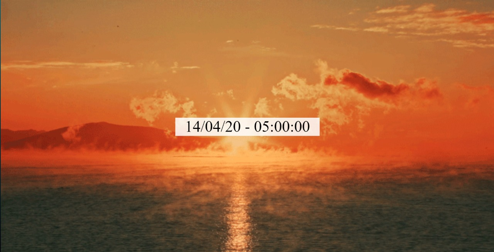 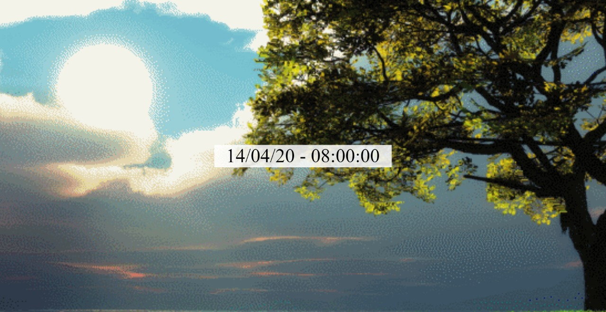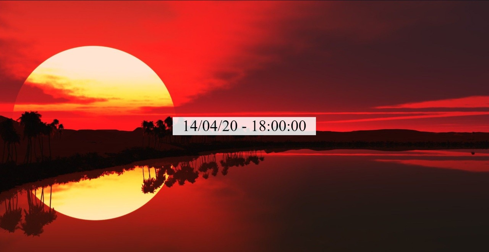 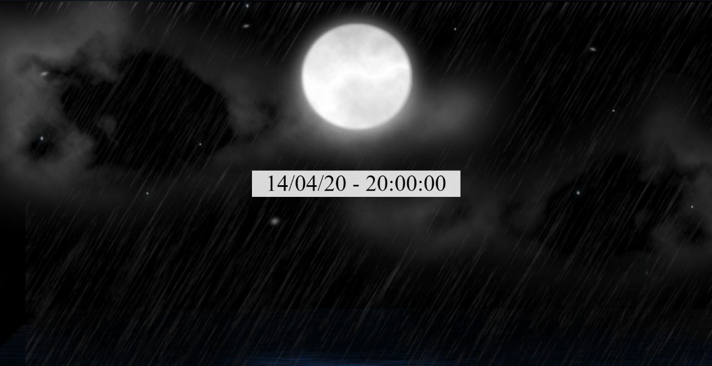

----------------------
Imagens no celular:

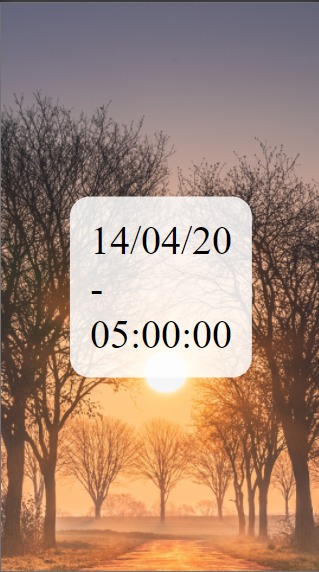 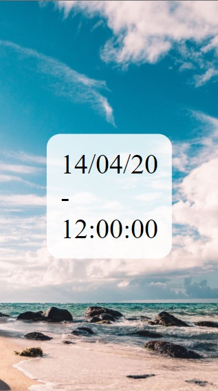 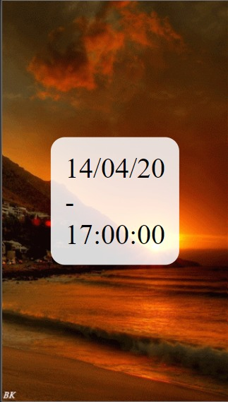 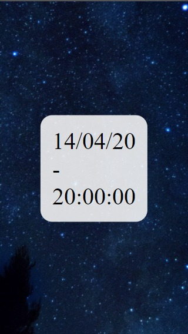

----------------------
Imagens em tablets:

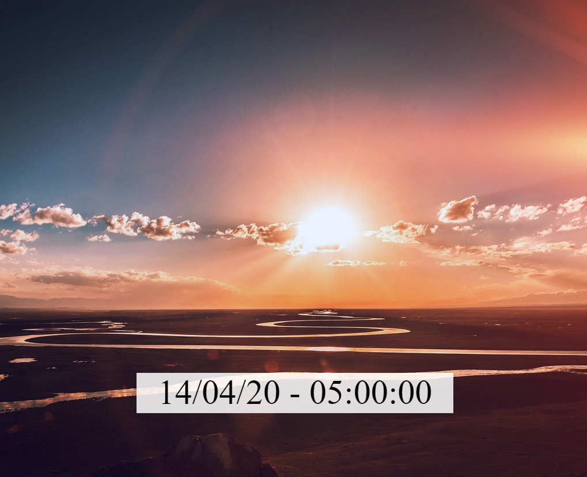 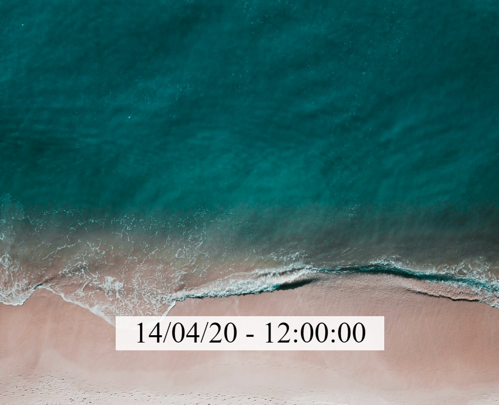  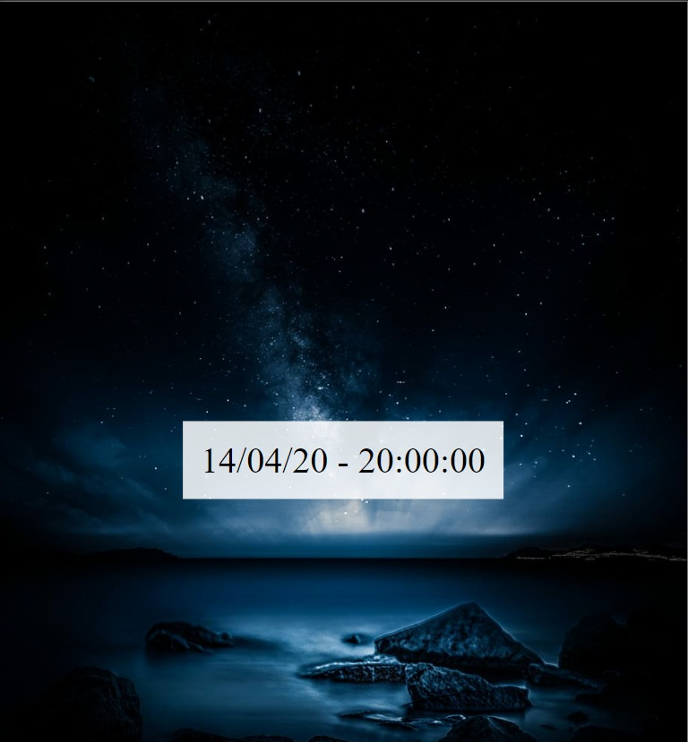
----------------------
Obs:Imagens de tamanhos diferentes devido as capturas de tela manuais
